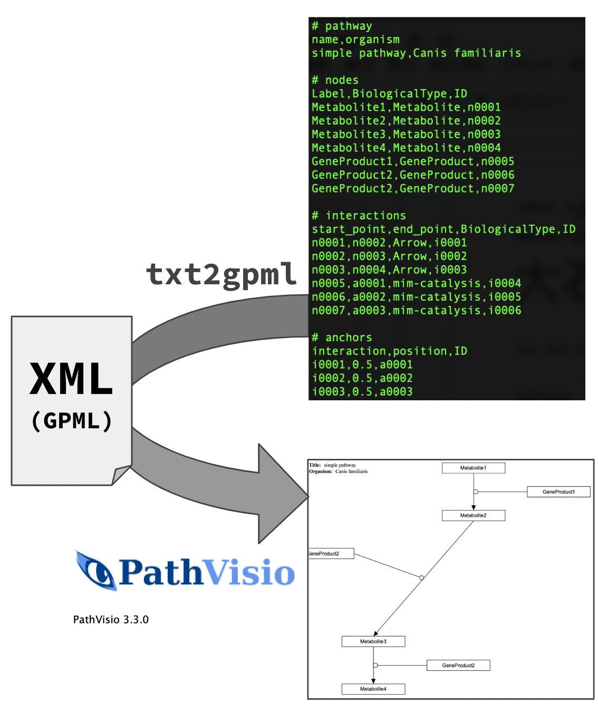
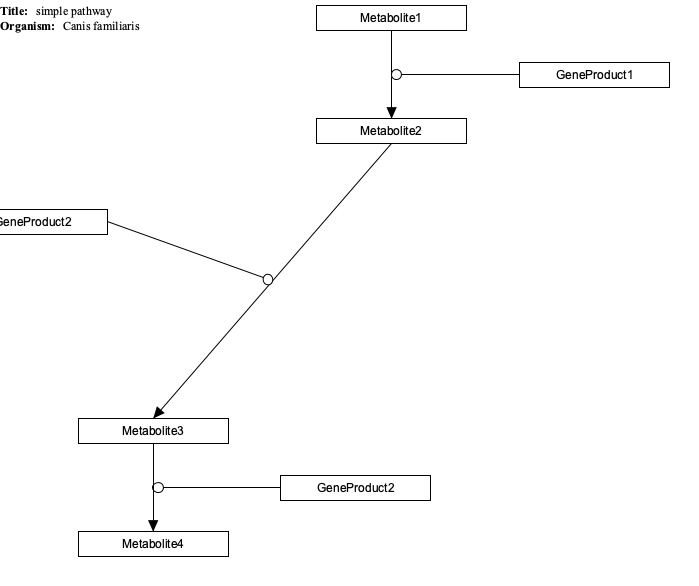

# Abstract

In addition to functional annotation of genes, annotating genes to pathways is important in current molecular biology.
But, pathway diagrams are required to annotate genes to nodes of those.
Therefore, it is important to draw pathway diagrams with assignment to genes and metabolites.
Existing metabolic pathway databases focus on generic pathways, while secondary metabolism is emphasized in organisms producing useful substances.
Moreover they cannot accept third party annotation of those data.
A practical system for pathway analyses is therefore really needed.

Following on from the previous BioHackathon (BH23), we first discussed how to create a database of pathway information in non-model species in a domestic version of the BioHackathon called BH23.9 held in Shirahama, Wakayama, Japan (25-29 September 2023).
We then gave a tutorial on how to write a pathway diagram using Pathvisio, which is a free open-source pathway analysis and drawing software which allows drawing, editing, and analyzing biological pathways. 
Finally we tried to establish the conversion system from text data to Graphical Pathway Markup Language (PGML), which is called `txt2pgml`.
`txt2pgml` will drastically reduce the time and effort required to create pathway diagrams.

After a stimulus discussion in BH23 and BH23.9, we could clarify the current issues in the pathway analysis for non-model organisms.

Keywords: pathway, non-model organisms

# Introduction

In the year 2023, genome analysis for non-model organisms has been getting attention.

For pathway analysis, Kyoto Encyclopedia of Genes and Genomes (KEGG) is widely used [@KEGG].
While only the category of genes are used for enrichment analysis of differentially expressed genes (DEG), KEGG is heavily used and cited.
For that purpose, KEGG is enoguth in addition to the gene annotation of Gene Ontology (GO).

However, KEGG is not suffcient for detailed pathway analysis in non-model organisms.
- No pathway diagrams exist for target pathway.
- Any modification for existing pathway diagrams allowed.
- Not free for bulk download.
So many obstacles exist for using KEGG.

We sought a proper system to make the database for our purose to see that WikiPathways is the best. 
It is because WikiPathways is an open science platform for biological pathways contributed, updated, and used by the research community [@WikiPathways].
We invited Dr. Pico Alex to BH23 to learn WikiPathways more deeply and discuss the collaboration in the study of non-model organisms [@BH23rep].
After the stimulus discussion in BH23, we plan to make a practical usecase and pathway XML generator.
Following that situation, we gave the tutorial for the use of pathway diagram drawing software and developed the pathway XML generator in BH23.9.

# Results

In 2023, we could hold both the international and domestic BioHackathons successfully (BH23 and BH23.9 respectively).
Following stimulus discussion at BH23 in Shodoshima summerized in our report [@BH23rep], we continued discussion at BH23.9 in Shirahama.
At BH23.9, we worked on the following points towards the development of pathway data in non-model organisms.


 

## Tutorial on drawing pathway diagrams

Currently, pathway diagrams in the manuscripts are drawn by general-purpose software, which includes Illustrator, PowerPoint and so on.
These softwares output pathway diagrams in image format (PDF, png and jpeg), and thus these cannot be re-use for other purpose.
Therefore, in order to be utilized in other purpose, researchers are encouraged to create pathway diagrams in reusable formats such as XML (GPML: Graphical Pathway Markup Language).
The WikiPathways project already has such software called PathVisio [@PathVisio3].

We gave a brief tutorial how to draw pathway diagrams by PathVisio (version3.3) in BH23.9.
In model organisms, genes and metabolites are already resistered in public DBs and we can assign those IDs to boxes in pathway diagrams while those gene IDs cannot be assigned in non-model organisms as they are not in public DBs.
We will tackle this issue in the next stage.

## Efforts toward how to create pathway data for non-model organisms

Continuing from BH23, we attempted to create pathway diagrams and develop a technique to reduce such effort by creating pathway diagrams in non-model organisms.

### Drawing diagram manually by current system

We have created a pathway diagram for non-model organisms.
~~(Current status should be added)~~
Specifically, the steroid hormones biosynthesis pathway in teleost fish was depicted by pathvisio (v3.3.0).
This diagram also includes the mevalonate pathway, which is essential for the synthesis of cholesterol, a precursor of steroid hormones.
Several reports on the identification of steroid synthesis pathways in gonads and steroid-metabolizing enzymes exist for several teleost fish species. 
The diagram is, therefore, expected to serve as a good model case to test the system currently being created.

### txt2gpml: pathway XML generator

We also worked on the development of tools to generate readable XML (GPML) for WikiPathways from nodes, anchors and interactions data described in text format.
The generator is coded in Python (version 3.9 or higher), and `networkx`, `matplotlib` and `pygraphviz` should be installed using `pip` (`graphviz` required for `pygraphviz`).

Following four elements are required as input data.
1. comma-separated data of pathway, nodes, edges, and anchors for each block.
2. If each block is preceded by a comment describing the type, for example, a line beginning with "# nodes", it is treated as a block describing a node up to the following empty line.
3. The first line of each block describes the header. The headers are converted to dictionary keys after the file is read.
4. IDs must be added for nodes, interactions and anchors. Each ID is a 5- or 8-digit string with the letters a-f as its initials.

Here is an example of a simple pathway.

```
# pathway
name,organism,layout
simple pathway,Canis familiaris,dot

# nodes
Label,BiologicalType,ID
Metabolite1,Metabolite,n0001
Metabolite2,Metabolite,n0002
GeneProduct1,GeneProduct,n0003

# interactions
start_point,end_point,BiologicalType,ID
n0001,n0002,Arrow,i0001
n0003,a0001,mim-catalysis,i0002

# anchors
interaction,position,ID
i0001,0.5,a0001
```

In 'pathway' section, you can specify the layout of graphviz, such as dot or circo. 
Default value is circo.

In 'interactions' section, interactions describe the start node and target node, each with a node ID. 
Interactions also describe the relationship between anchors and nodes. 
Currently, when an interaction combines an anchor and a node, be sure to specify the anchor at the "end_point".

The 'anchors' section describes the interaction in which the anchor is placed, its relative position in the interaction, and the ID of the anchor.

By the text above, GPML for Pathvisio (WikiPathways) can be generated and pathway diagram below can be drawn by that GPML.



`txt2gpml` is developed in GitHub repository under the Creative Commons Zero v1.0 Universal license.
https://github.com/dogrun-inc/txt2gpml/


# Conclusion

After a stimulus discussion in BH23.9, we could clarify the current issues in the pathway data analysis for non-model organisms.

# Future work

We plan to draw pathway diagrams by using `txt2gpml` to enrich the pathway diagram resource in WikiPathways.
In parallel, we will make system for analyzing quantitative data (gene expression intensity and abundance of metabolites) in non-model organism.
We will also continue our current efforts to update `txt2gpml` for better assist in drawing pathway diagrams.

# Acknowledgement

We thank Dr. Alex Pico for the continuous support from BH23 to the project.

We deeply thank organizers of BH23.9 (domestic biohackathon in Japan) at Shirahama (25-29 August 2021) for giving us a chance to discuss the system.

# References

